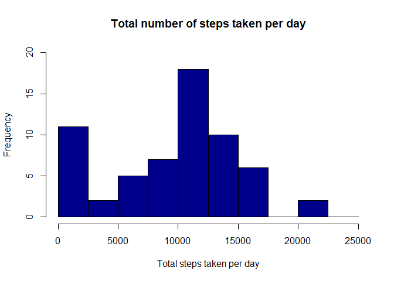

## Loading and preprocessing the data

```r
library(dplyr)
```

```
## Warning: package 'dplyr' was built under R version 4.2.2
```

```
## 
## Attaching package: 'dplyr'
```

```
## The following objects are masked from 'package:stats':
## 
##     filter, lag
```

```
## The following objects are masked from 'package:base':
## 
##     intersect, setdiff, setequal, union
```

```r
library(ggplot2)
```


```r
Sys.setlocale("LC_TIME", "en_US")
```

```
## [1] "en_US"
```

```r
stepdata=read.csv("./activity.csv")
stepdata$date=as.Date(stepdata$date)
stepdata$weekday=weekdays(stepdata$date)
head(stepdata)
```

```
##   steps       date interval weekday
## 1    NA 2012-10-01        0  Monday
## 2    NA 2012-10-01        5  Monday
## 3    NA 2012-10-01       10  Monday
## 4    NA 2012-10-01       15  Monday
## 5    NA 2012-10-01       20  Monday
## 6    NA 2012-10-01       25  Monday
```

## Histogram of the total number of steps taken each day


```r
steps_per_day = stepdata %>% group_by(date) %>% summarise(step.by.date=sum(steps,na.rm=TRUE))
head(steps_per_day )
```

```
## # A tibble: 6 × 2
##   date       step.by.date
##   <date>            <int>
## 1 2012-10-01            0
## 2 2012-10-02          126
## 3 2012-10-03        11352
## 4 2012-10-04        12116
## 5 2012-10-05        13294
## 6 2012-10-06        15420
```


```r
hist(steps_per_day$step.by.date, main = "Total number of steps taken per day", xlab = "Total steps taken per day", col = "darkblue", ylim = c(0,20), breaks = seq(0,25000, by=2500))
```

<!-- -->

## What is mean total number of steps taken per day?

```r
mean_steps=mean(steps_per_day$step.by.date)
median_steps=median(steps_per_day$step.by.date)
cat("Mean =",mean_steps, "| Median =", median_steps)
```

```
## Mean = 9354.23 | Median = 10395
```

## What is the average daily activity pattern?
Time series plot for daily step taken

```r
mean_steps_by_date=stepdata %>% group_by(date) %>% summarise(mean.steps=mean(steps,na.rm=TRUE))
with(mean_steps_by_date,plot(date,mean.steps,type="l",lwd=2))
```

<!-- -->


Time series plot for average daily pattern by intervals

```r
mean_steps_by_interval=stepdata %>% group_by(interval) %>% summarise(mean.steps=mean(steps,na.rm=TRUE))
head(mean_steps_by_interval)
```

```
## # A tibble: 6 × 2
##   interval mean.steps
##      <int>      <dbl>
## 1        0     1.72  
## 2        5     0.340 
## 3       10     0.132 
## 4       15     0.151 
## 5       20     0.0755
## 6       25     2.09
```


```r
with(mean_steps_by_interval,plot(interval,mean.steps,type="l",xlab = "Interval", ylab = "Average number of steps", main = "Average number of steps per interval"))
```

<!-- -->

5-minute interval, on average across all the days in the dataset, contains the maximum number of steps

```r
mean_steps_by_interval[which.max(mean_steps_by_interval$mean.steps),]$interval
```

```
## [1] 835
```


## Imputing missing values

```r
na.values=sum(is.na(stepdata$steps))
cat("Total numbers of NAs is ",na.values,", this acounts for ",na.values/nrow(stepdata
                                                                              )*100, "% of the dataset")
```

```
## Total numbers of NAs is  2304 , this acounts for  13.11475 % of the dataset
```
The strategy is to fill all of the NAs by the average steps of the correspondent intervals


```r
filled_NA=left_join(stepdata,mean_steps_by_interval,by="interval")
filled_NA$steps=ifelse(is.na(filled_NA$steps), yes=filled_NA$mean.steps,no=filled_NA$steps)
head(filled_NA)
```

```
##       steps       date interval weekday mean.steps
## 1 1.7169811 2012-10-01        0  Monday  1.7169811
## 2 0.3396226 2012-10-01        5  Monday  0.3396226
## 3 0.1320755 2012-10-01       10  Monday  0.1320755
## 4 0.1509434 2012-10-01       15  Monday  0.1509434
## 5 0.0754717 2012-10-01       20  Monday  0.0754717
## 6 2.0943396 2012-10-01       25  Monday  2.0943396
```

```r
fill_NA_sum= filled_NA %>% group_by(date) %>% summarise(total.steps=sum(steps))
```

Histogram of the total number of steps taken each day after missing values are imputed

```r
par(mfrow = c(1, 2))
hist(steps_per_day$step.by.date,main="total steps each day in the \noriginal data",breaks = seq(0,25000, by=2500),xlab = "Total steps by date")
hist(fill_NA_sum$total.steps,main="total steps each day in the \nclean data",breaks = seq(0,25000, by=2500),xlab = "Total steps by date")
```

<!-- -->


## Are there differences in activity patterns between weekdays and weekends?

```r
filled_NA$datetype=ifelse((filled_NA$weekday %in% c("Saturday","Sunday")),"weekend","weekday")
pattern=filled_NA %>% group_by(interval, datetype) %>% summarise(average.steps=mean(steps))
```

```
## `summarise()` has grouped output by 'interval'. You can override using the
## `.groups` argument.
```

Compare the average steps for weekday and weekend


```r
g=ggplot(pattern,aes(interval,average.steps,col=datetype))
g+geom_line()+facet_wrap(.~datetype,ncol=1, nrow=2) + labs(title = "Average daily steps by date type", x = "Interval", y = "Average number of steps")
```

<!-- -->

